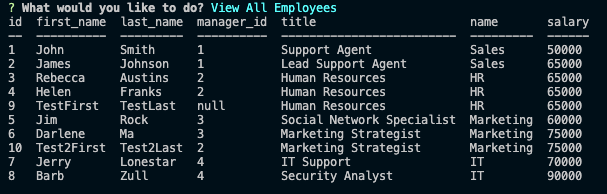

# Employee Tracker

## Description 

A CLI application for building and maintaining a company employee database. Within this app, you can view & create departments, roles, and employees. 
Future development includes adding the functions to assign managers, delete entries, and further update employee information. 

## Table of Contents
* [Links](#links)
* [Technologies](#technologies)
* [Usage](#usage)
* [Screenshots](#screenshots)
* [Demo](#demo)

## Links 

* Local: See [Usage](#Usage) for local setup instructions 

## Technologies

* Javascript
* Node.js
* Express.js
* FS Node.js 
* Inquirer
* MySQL

## Usage 

Setup/Installation
* If you do not have `Node.js` installed, [click here](https://nodejs.org/en/) to download and install. 
* Once you have downloaded the repositories, open the terminal and install the dependencies by running `npm i`. 
* Open MySQL by typing in `mysql -u root -p` and enter your password when prompted.
* Run `source db/schema.sql` to create the database, followed by `exit` to exit mysql.
* Seed the database in terminal by running `npm run seed`.
* For startup, make sure to enter your MySQL password on line 12 of the index.js file and save -- it is marked. 

Startup
* Once you've completed setup, run `npm start` to start the application. 
* Choose the different options for viewing & creating departments, roles, and employees. 
* After answering the prompts, the data will be entered into the database. 
* The data is then viewable via the View options in the app, or MySQL workbench. 

## Screenshots

## Demo

